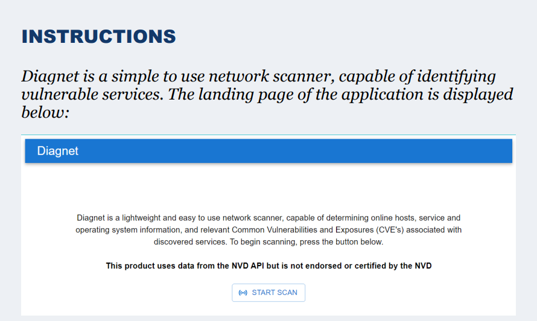
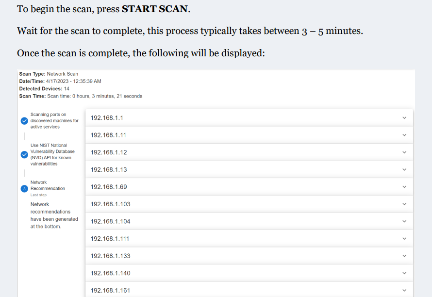
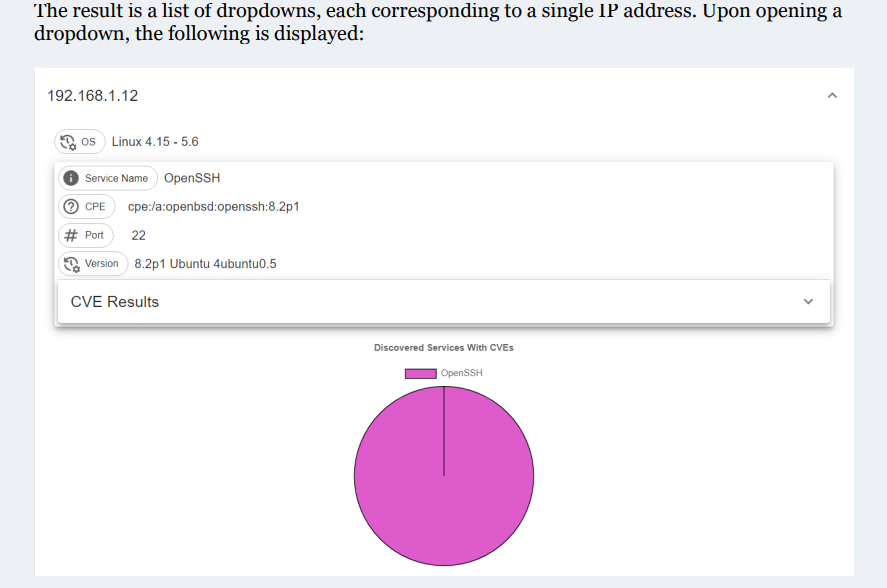
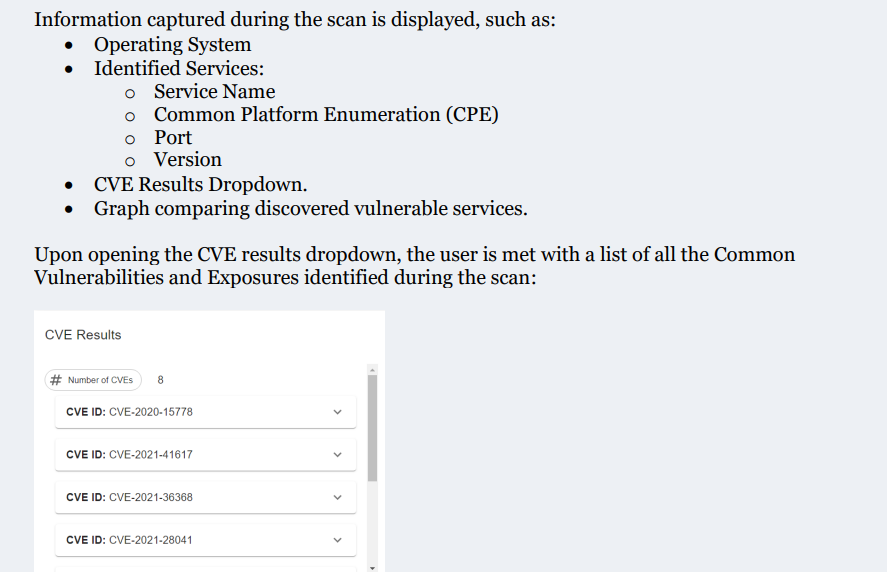
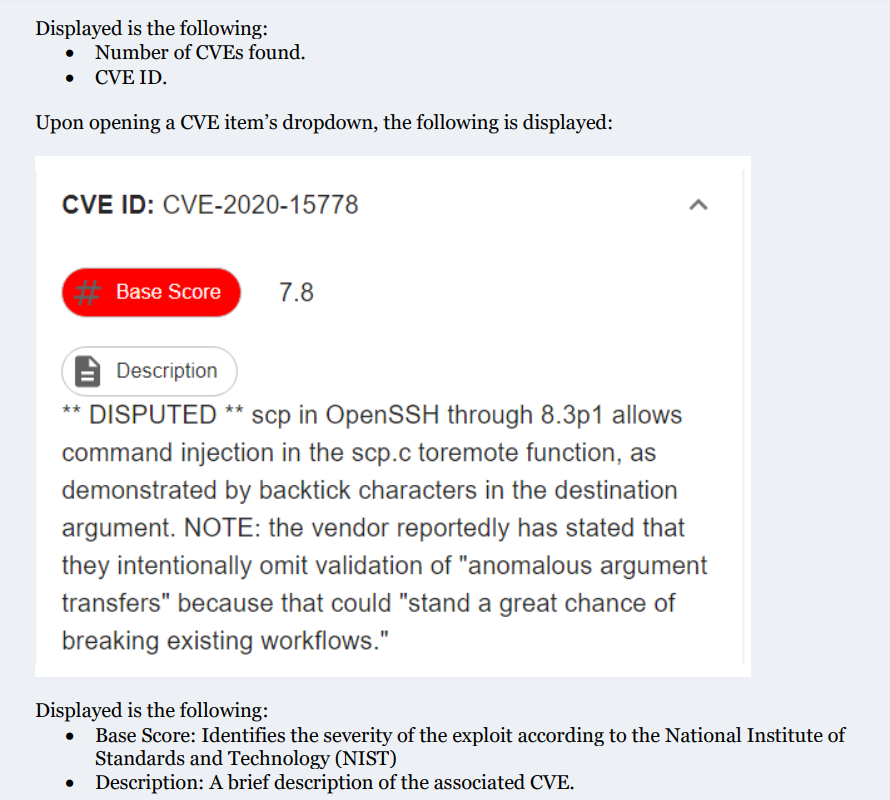
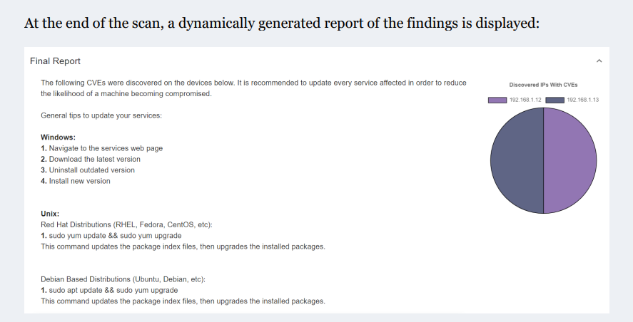

# Description
Diagnet is a software application that allows its users to scan their local network for useful
information, such as online devices, services running on those devices, and whether those services
are outdated and vulnerable, all with the click of a single button. Through wrapping the functionality
of Nmap, its powerful network scanning capabilities can be utilized in a simple yet intuitive way.
Diagnet is intended to be targeted towards less technically inclined individuals, which means that
the usability is heavily focused on to create a simple experience for the user. This user-friendly
approach is achieved using Electron, a desktop application framework which uses React to handle
the user interaction, and Node.js to manage the computationally intensive tasks.

## Disclaimer
This application was created for my COMP 8047 - Major Project submission, so further development/maintenance can not be guaranteed.

# User Guide
## Installation
1. Clone this repository.
2. run `npm i` in the root directory to install all dependencies.

## Running
Run `npm start`. This should start the renderer process.

## Usage Guide

